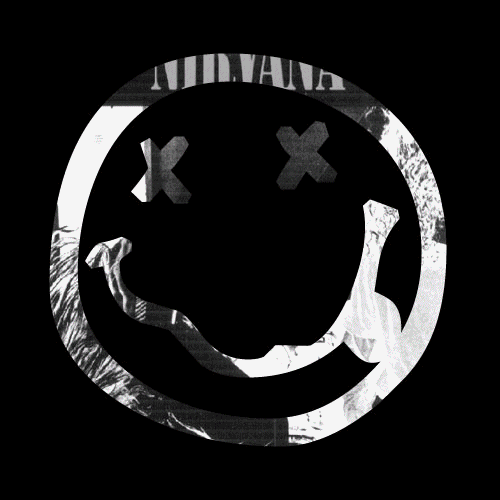

<h1 align="left">Eduardo Paim</h1>


<table>
  <tr>
    <td>

```js
// aboutme.js

const name = "Eduardo Paim";
const title = "Full Stack Developer";
const education = "Student of Systems Analysis and Development at Senac RS";

const summary = `
I develop scalable APIs and modern, responsive user interfaces.
My work emphasizes clean code, performance, and maintainability.
I believe in building intuitive solutions that solve real-world problems.
`;

```
</td> 
<td> 
 </td> </tr> </table> 

<h2 align="left">Stats: </h2>


<div align="center">
   
  <br><br>

  <details>
    <summary><strong>Show Achievements</strong></summary><br>
    
  </details>
</div>


<div align="center">

  <h2 align="left" style="width: 100%;">Stacks:</h2>
  <br/>

<table style="width: 100%; margin: 0 auto;">
<tr>
  <td valign="top" style="padding: 0 20px;">
    <h3 align="center" >Languages</h3>
    <br>
    <div align="center" style="display: flex; flex-wrap: wrap; gap: 10px;">
    
    
    
    
    
    
    
    </div>
  </td>

   <td valign="top" style="padding: 0 20px;">
    <h3 align="center" >Databases</h3>
    <br>
    <div align="center" style="display: flex; flex-wrap: wrap; gap: 10px;">
    
    
    
    
    
    </div>
  </td>

  <td valign="top" style="padding: 0 20px;">
    <h3 align="center" >Frameworks & Tools</h3>
    <br>
    <div align="center" style="display: flex; flex-wrap: wrap; gap: 10px;">
    
    
    
    
    
    
    </div>
  </td>
</tr>
</table>

</div>


<h2 align="left">Find me: </h2>
<br>

<div align="center">
  <a href="https://mail.google.com/mail/?view=cm&fs=1&to=edupaim1712@gmail.com" target="_blank">
    
  </a>
  <a href="https://www.linkedin.com/in/eduardo-paim-a89685341/" target="_blank">
    
  </a>
  <a href="https://wa.me/5551992009287" target="_blank">
    
  </a>
  <details>
    <summary><strong>.</strong></summary><br>
      <h1>Gremio</h1>
  
</div>


