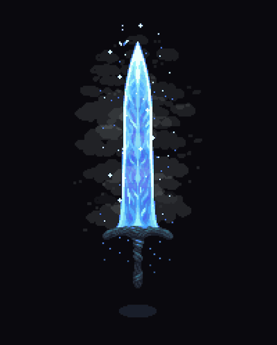

<!--
Perfil minimalista, criativo e compacto — tons cinza-azulados, informações agrupadas e visual fluido.
Este README foi otimizado para visualização no GitHub, usando Markdown puro, imagens e badges.
-->

<table>
  <tr>
    <td valign="top" width="60%">

# Eduardo Paim

**Full Stack Developer** • 19y old  
Senac RS &nbsp;|&nbsp; Minimalismo & Criatividade

Graduando em **ADS** (Senac RS), apaixonado por criar APIs robustas, interfaces modernas e experiências minimalistas. Curioso, autodidata e colaborador open source.

 

**Stack Essencial:**  
Python • JavaScript • TypeScript • React • Django • Node.js • PostgreSQL • Git

  
  
  
  
  
  
  
  
  

 

**Objetivos:**  
Projetos de impacto, aplicações escaláveis e elegantes, evolução constante — sem perder minha essência.

 

   </td>
   <td valign="middle" align="center" width="40%">
     
   </td>
  </tr>
</table>

 

 

  
    Crio, evoluo e compartilho — sempre buscando o próximo nível. 
    Obrigado pela visita!
  

